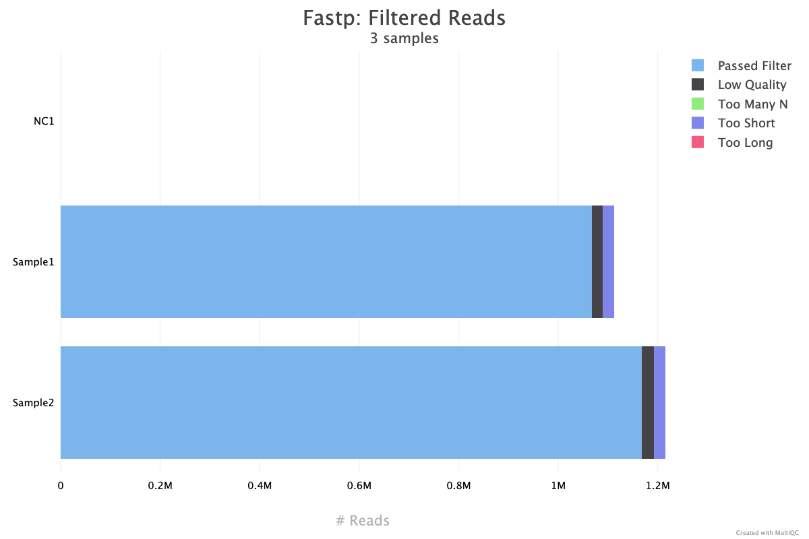

# eDentity-metabarcoding-pipeline

- [Installation](#installation)
- [Input](#input)
- [Outputs](#outputs)
- [Programmatic Execution via Galaxy API](#programmatic-execution-via-galaxy-api)
- [citations](#citations)

This repository provides a Galaxy tool wrapper for executing the [edentity](https://pypi.org/project/edentity/) metabarcoding pipeline within the Galaxy environment. It enables reproducible and scalable analysis of amplicon sequencing data using [Snakemake](https://snakemake.readthedocs.io/). It denoises amplicon sequences using `vsearch` to generate Exact Sequence Variants (ESVs).

> **Note:**  
> Taxonomic identification is not included. The ESVs can be used as input for other taxonomic assignment tools.

## Installation
This tool can be installed directly from the Galaxy ToolShed. You must be an administrator of your Galaxy instance to install new tools, or you can request your Galaxy admin to install it for you.

1. Log in to your Galaxy instance as an admin.
2. Navigate to **Admin > Tool Management > Install and Uninstall**.
3. Search for `eDentity Metabarcoding Pipeline`.
4. Follow the prompts to install the tool.

For more details, see the [Galaxy ToolShed documentation](https://galaxyproject.org/toolshed/).

## Input 
zip folder with fastq sequence files.
## Outputs

### ESV_table.tsv: Abundance of each ESV per sample.

| ESV_NO | ESV_ID                              | Sample1 | Sample2 | sequence                   |
|--------|-------------------------------------|---------|---------|----------------------------|
| ESV_1  | 9bc4f41860c78e9560383d55ef9e9681a650c125 | 324091  | 353306  | GCGGTTAAACGAGAGGCCCTAGT    |
| ESV_2  | 062c4dccaa466a10caf68ac0c4ccb5f56d7eebf1 | 20556   | 22734   | GCGGTTAAACGAGAGGCCCTAGT    |
| ESV_3  | 298ec38310894016e0ba9b3e3eb2f73a9167a678 | 4350    | 4866    | GCGGTTAAACGAGAGGCCCTAGT    |
| ESV_4  | dd5dd0619e9006a570699de9398031364d43a266 | 2940    | 3311    | GCGGTTAAACGAGAGGCCCTAGTTAATAATACACGG |

### Summary_report.tsv: Summary of reads at each analysis step.


| Sample   | total_reads | fastp_filtered | merged | merged_percent | trimmed | vsearch_filtered | dereplicated | denoised | chimeric | borderline | n_esv |
|----------|-------------|----------------|--------|----------------|---------|------------------|--------------|----------|----------|------------|-------|
| Sample1  | 556245      | 533823         | 529890 | 99.26          | 529890  | 528714           | 27044        | 2449     | 22       | 0          | 103   |
| NC1      | 32          | 22             | 22     | 100.00         | 22      | 21               | 18           | 0        | 0        | 0          | 0     |
| Sample2  | 607699      | 583939         | 579515 | 99.24          | 579515  | 578221           | 28854        | 2668     | 26       | 0          | 105   |

### ESV_sequences.fasta: ESV sequences for taxonomic identification.
```
>9bc4f41860c78e9560383d55ef9e9681a650c125
GCGGTTAAACGAGAGGCCCTAGT
>062c4dccaa466a10caf68ac0c4ccb5f56d7eebf1
GCGGTTAAACGAGAGGCCCTAGT
>dd5dd0619e9006a570699de9398031364d43a266
GCGGTTAAACGAGAGGCCCTAGTTAATAATACACGG 
```
### Quality_control_report.html: An interactive visualization of quality metrics and read statistics.


*Figure: Example plot showing the distribution of reads after fastp filtering across samples. The HTML report includes many other interactive plots visualizing each step of the analysis pipeline.*


These outputs support further analysis and interpretation.

## Programmatic Execution via Galaxy API
You can programmatically execute the eDentity Metabarcoding Pipeline on Galaxy via the API using the [nbitk](https://pypi.org/project/nbitk/) Python package.

**Note:** 
> The eDentity Metabarcoding Pipeline tool must be installed on your Galaxy instance before you can use the API to execute it.

### Requirements

Install the required packages:
```bash
pip install "nbitk>0.5.10" "bioblend>=1.6.0" 
```


Set your Galaxy instance URL and API key as environment variables:
```bash
export GALAXY_DOMAIN="https://your-galaxy-instance"
export GALAXY_API_KEY="your-api-key"

```
Then, in Python:

```python
from nbitk.Services.Galaxy.metabarcoding import MetabarcodingToolClient 
from nbitk.config import Config

# init metabarcoding client
config = Config()
config.config_data = {}
config.initialized = True
metabarcoding = MetabarcodingToolClient(config)

# Configure Galaxy History
metabarcoding.config_history(
    history_name='your history name', # do not set if you want to use a newly created history
    existing_history=True # do not set if you want to use a newly created history
)

# Upload zipped FASTQ files
metabarcoding._upload_file(
    file_path='path/to/the/fastqs.zip',
    file_type="zip"
)

# Define tool parameters
params = {
    'project_name': # name of your project; must not have spaces
    'data_type': 'Illumina', # [Illumina, AVITI], one of the two
    'input_fastqs': # name of the dataset you want to run e.g 'fastqs.zip', 
    'n_max': '0',
    'average_qual': '25',
    'length_required': '100',
    'fastq_maxdiffpct': '100',
    'fastq_maxdiffs': '5',
    'fastq_minovlen': '10',
    'forward_primer':  # forward primer sequence; comma separated if more than one,
    'reverse_primer': # reverse primer sequence; comma separated if more than one,
    'discard_untrimmed': 'True',
    "anchored": 'True',
    'minlen': '150',
    'maxlen': '700',
    'maxee': '1',
    'fasta_width': '0',
    'alpha': '2',
    'minsize': '4',
    'create_extended_json_reports': 'False', # set to True if detailed metrics on ESV is needed
}

# Run the tool
metabarcoding.run_metabarcoding(params)

# Download specific output files
metabarcoding.download_results(
    job_id=metabarcoding.job_id,
    output_path='test_downloaded_dataset',
    output_names=[
        'ESV_table',
        'multiqc_report',
        'ESV_sequences',
        'json_reports',
        'summary_report'
    ]
)

# Or download the entire history as an RO-Crate object
metabarcoding.export_history_as_rocrate(
    target_path='path/to/export/RO-Crate.zip',  # Export path; should end with '.zip'
    max_wait=120,
    include_hidden = False, 
    include_deleted = False 
)
```


## citations
```
- Naturalis Biodiversity Center. (2025). *eDentity metabarcoding Pipeline* [Computer software]. https://github.com/naturalis/galaxy-tool-edentity-metabarcoding-pipeline.git

- Rognes, T., Flouri, T., Nichols, B., Quince, C., & Mahé, F. (2016). VSEARCH: A versatile open source tool for metagenomics. *PeerJ*, *4*, e2584. https://doi.org/10.7717/peerj.2584

- Buchner, D., Macher, T.-H., & Leese, F. (2022). APSCALE: Advanced pipeline for simple yet comprehensive analyses of DNA metabarcoding data. *Bioinformatics*. https://doi.org/10.1093/bioinformatics/btac588
```
